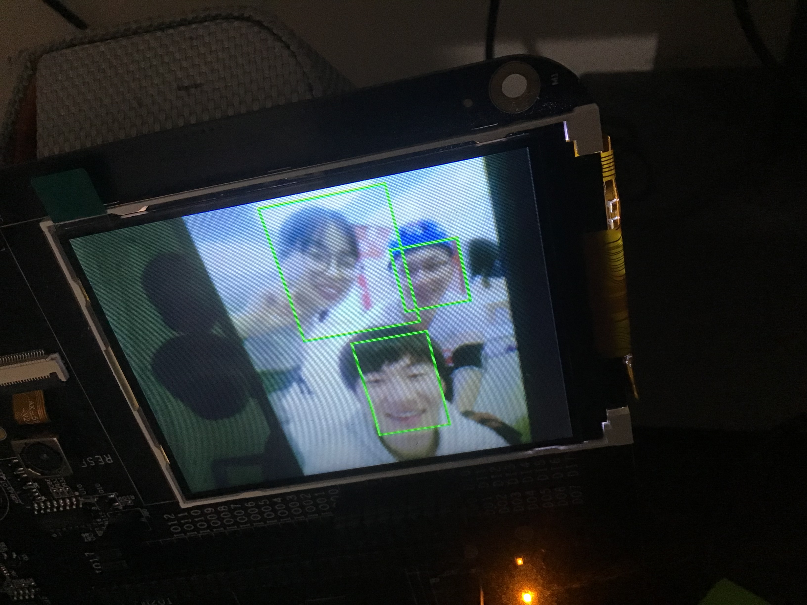

# k210 face detection demo

I implement face detection based on the idea of ​​yolo network in Kendryte K210. ps : this model only 500kb


# Usage

## train model

1. prepare dataset and make train list

    ```sh
    cd k210-face-detection
    wget http://tamaraberg.com/faceDataset/originalPics.tar.gz
    mkdir FDDB
    tar -zxvf originalPics.tar.gz -C FDDB
    wget http://vis-www.cs.umass.edu/fddb/FDDB-folds.tgz
    tar -zxvf FDDB-folds.tgz -C FDDB
    python3 tools/make_list.py --fddb_dir FDDB --ann_dir FDDB/FDDB-folds
    ```
    now your data fold have train.list
    **NOTE:**  When generate the train.list I set the box width and height only half. if you want use the normal value to train, please remove the comment in tools/make_list.py line `47`
    
2. train 
   
    ```sh
    make train_pureconv ILR=0.001 MAXEP=20 IAA=false
    ```
    ILR   : the init learning rate
    MAXEP : max epoch
    IAA   : whether to use data augmenter
    **NOTE:** you can use `CKPT:xxxxx` to continue train
    example:
    ```sh
    make train_pureconv CKPT=log/20190216-152633 ILR=0.0005 MAXEP=20 IAA=true
    ```
    
    And you can use `tensorboard  --logdir log` to look the record
    
## test model
    ```sh
    make inference PB=Freeze_save.pb
    ```


## export pb

1.  freeze ckpt

    ```sh
    make freeze CKPT=log/20190216-154422 
    ```
    now your fold will have `Freeze_save.pb`

2.  use kendryte-model-complier to complie pb file
    you can use my script (you should modify MODELCMP):
    ```sh
    make kmodel_convert PB=Freeze_save.pb MODELCMP=~/Documents/kendryte-model-compiler
    ```
    or refer to see the [kendryte-model-compiler](https://github.com/kendryte/kendryte-model-compiler)

##  modfiy k210 code

1.  copy weights array to code

    ```sh
    cp ~/Documents/kendryte-model-compiler/build/gencode_output.* K210_code/
    ```
    
2.  compile the code

    you can refer to the documents [k210 use in windows](https://zhen8838.github.io/2018/11/02/k210-windows/) or [k210 use in linux](https://zhen8838.github.io/2018/10/31/k210%E4%B8%8A%E6%89%8B/)
    
    And you can find some useful article in my bolg.

3.  down load program

    now you can use [kflash.py](https://github.com/kendryte/kflash.py) down load the program
    

# Final effect

   